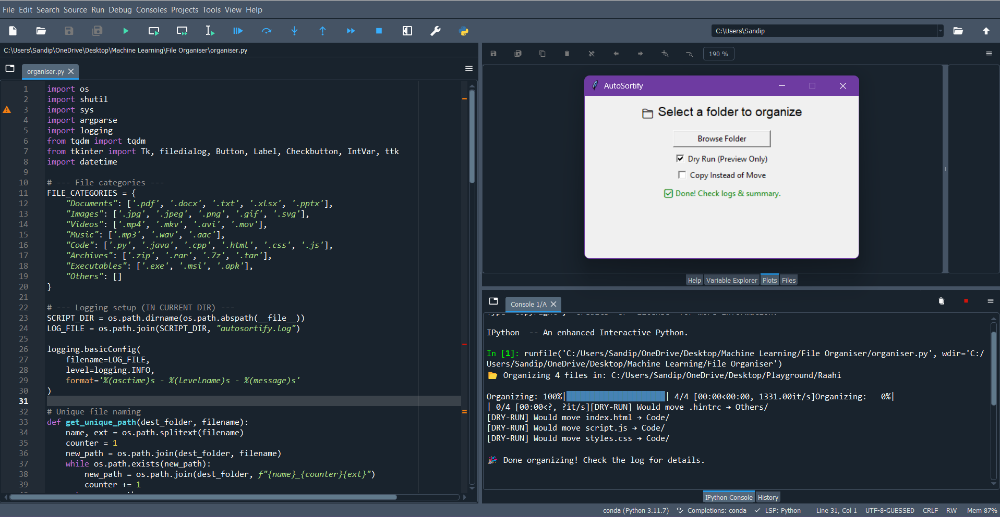

# AutoSortify 🚀

**AutoSortify** is a smart file organizer with both CLI and GUI support. It organizes your digital mess into categorized folders with detailed logs, real-time progress bars, dry-run preview, and dark mode GUI — all wrapped in one sleek Python project.

## 🔥 Features

- 📁 Categorizes files by extension into folders like Documents, Images, Videos, etc.
- 🎛️ GUI built with Tkinter (with Dark/Light mode toggle)
- 💻 CLI mode with flags for dry-run and copy
- 📈 Real-time progress bar with `tqdm`
- 🪵 Full logging support
- 🧾 Generates a detailed summary report
- 🔐 Handles filename conflicts safely
- ⏲️ Cron & Task Scheduler compatible
- 🧪 Dry run mode to preview changes
- 💾 Log and summary saved in `~/AutoSortify/`
---

## 📦 File Categories

| Category     | Extensions                                        |
|--------------|---------------------------------------------------|
| Documents    | `.pdf`, `.docx`, `.txt`, `.xlsx`, `.pptx`         |
| Images       | `.jpg`, `.jpeg`, `.png`, `.svg`, `.gif`           |
| Videos       | `.mp4`, `.mkv`, `.avi`, `.mov`                    |
| Music        | `.mp3`, `.wav`, `.aac`                            |
| Code         | `.py`, `.cpp`, `.java`, `.js`, `.html`, `.css`    |
| Archives     | `.zip`, `.rar`, `.7z`, `.tar`                     |
| Executables  | `.exe`, `.msi`, `.apk`                            |
| Others       | Everything else                                   |

---

## 🧠 How It Works

AutoSortify scans the specified folder, detects file types based on extension, and moves them into clean, categorized subfolders like:

---

## 🖼️ GUI Preview 

<p align="center">
  
</p>

---

## 📌 Usage

### 1. Clone the repo

```bash
git clone https://github.com/your-username/AutoSortify.git
cd AutoSortify
```
### 2. Run the script

```bash
python main.py /path/to/your/folder
```
---

## 📅 Setup Scheduled Run (Optional)
### Windows Task Scheduler:
- Open Task Scheduler → Create Basic Task
- Trigger: Daily/Weekly
- Action: Start a Program → python path_to_main.py "C:/Your/Folder"

---

## 📄 Logs
- Logs are saved in: ~/AutoSortify/autosortify.log
- Summary is saved as: ~/AutoSortify/summary.txt


